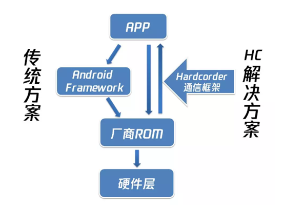

# Hardcoder

**Hardcoder 是一套 Android APP 与系统间的通信解决方案，突破了 APP 只能调用系统标准 API，无法直接调用系统底层硬件资源的问题，让 Android APP 和系统能实时通信。APP 能充分调度系统资源如 CPU 频率，大小核，GPU 频率等来提升 APP 性能，系统能够从 APP 侧获取更多信息以便更合理提供各项系统资源。同时，对于 Android 缺乏标准接口实现的功能，APP 和系统也可以通过该框架实现机型适配和功能拓展。**

Hardcoder 在微信的启动、发送视频、小程序启动等重度场景平均优化效果达 10%-30%；在手机 QQ 的启动、打开聊天界面、发送图片等场景的平均优化效果达 10%-50%。该框架目前已接入 OPPO、vivo、华为、小米、三星、魅族等主流手机厂商，覆盖 4.6+ 亿设备量。

## 接入流程

1. 通过 [Hardcoder 产品方案介绍](./hardcoder_introduction.md)，了解 Hardcoder；
2. 通过 [Hardcoder 技术方案介绍](./hardcoder_technology_introduction.md)，了解 Hardcoder 实现原理以及框架；
3. 使用工程自带 testapp 快速使用 Hardcoder 并验证效果，具体请见 [Hardcoder Testapp 测试指南](./hardcoder_testapp_test_guide.md)；
4. APP 接入 Hardcoder，具体请参见 [Hardcoder 接入指南](./hardcoder_users_guide.md)：
   1. 下载 Hardcoder 工程编译 aar；
   2. 项目 `build.gradle ` 引入 Hardcoder aar； 
   3. 进程启动时调用 initHardCoder 建立 socket 连接（一般进程启动时需要请求资源，因而推荐在进程启动时调用）。每个进程都是独立的，都需要调用 initHardCoder 建立 socket 连接，建立连接后每个进程维持一个 socket，进程退出时 socket 也会断开；
   4. initHardCoder 回调成功后调用 checkPermission，传入 APP 已申请的各个厂商鉴权值；
   5. 在需要请求资源的场景调用 startPerformance，传入请求资源的参数。若场景位于进程启动阶段，比如 APP 启动，需要在 initHardCoder 的回调成功以后再调用 startPerformance，确保连接已成功建立，或者判断 HardCoderJNI 的 isConnect() 检查 socket 是否已连接。
   6. 场景结束时主动调用 stopPerformance，传入对应场景 startPerformance 时的返回值 hashCode 作为参数，停止本次请求。
   7. 测试性能，APP 可对打开/关闭 Hardcoder 的情况做对比实验，测试性能是否有提升。
5. 向厂商申请线上权限，具体请见[常见问题](./FAQ.md)；
6. 发布带 Hardcoder 功能的 APP。

## 文档指引

1. Hardcoder 产品方案介绍——https://github.com/Tencent/Hardcoder/blob/master/docs/hardcoder_introduction.md
2. Hardcoder 技术方案介绍——https://github.com/Tencent/Hardcoder/blob/master/docs/hardcoder_technology_introduction.md
3.  Hardcoder testapp 测试指南——https://github.com/Tencent/Hardcoder/blob/master/docs/hardcoder_testapp_test_guide.md
4.  Hardcoder 接入指南——https://github.com/Tencent/Hardcoder/blob/master/docs/hardcoder_users_guide.md
5. 常见问题——https://github.com/Tencent/Hardcoder/blob/master/docs/FAQ.md

## License

Hardcoder 遵守 BSD license，详情请见 [LICENSE](./../LICENSE) 文件。

