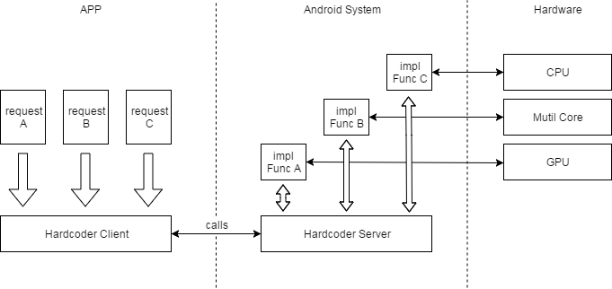
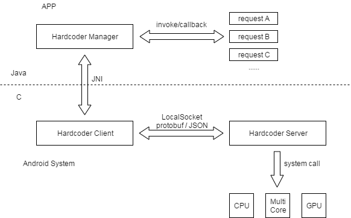

# Hardcoder——安卓 APP 与系统间通信解决方案

 

### Hardcoder 的诞生

随着微信越来越复杂，性能优化变得越来越难做，优化所带来的效果提升也越来越不明显。所以我们一直在思考，该如何突破这个优化的极限？

直到有一次与厂商的交流我们了解到，部分厂商会针对微信做一些小改动，其中比较典型的就是“暴力提频"。系统在识别到微信启动，页面切换等场景时，会粗暴地提高 CPU 频率，从而提升 APP 运行的性能。

但由于厂商无法准确判断微信场景，暴力提频效果并不理想；而如果过多地提高 CPU 频率，又对手机的功耗有影响。这一方案启发了我们，我们何不跳出软件的范畴，在手机硬件的层面上挖掘更多的性能优化空间呢？于是 Hardcoder 框架应运而生。

### Hardcoder 是什么

厂商暴力提频效果不理想是由于在目前 Android 框架下，手机没有办法准确获知 APP 需要资源的时机。如果我们需要挖掘手机硬件层面的性能优化，就需要跳过 Android 操作系统的应用框架，在应用开发者和硬件之间打开一个通道，让硬件可以直接根据应用开发者的需要进行资源的调度。

Hardcoder 构建了 APP 与系统（ROM）之间可靠的通信框架，突破了 APP 只能调用系统标准 API，无法直接调用系统底层硬件资源的问题，让 Android APP 和系统能实时通信。

利用 Hardcoder，APP 能充分调度系统资源如 CPU 频率，大小核，GPU 频率等来提升 APP 性能，系统能够从 APP 侧获取更多信息以便更合理提供各项系统资源。同时，对于 Android 缺乏标准接口实现的功能，APP 和系统间也可以通过该框架实现机型适配和功能拓展。

### Hardcoder 框架通信流程

Hardcoder 框架分为 Server 端和 Client 端。其中 Server 端在厂商系统侧实现，Client 端以 aar 形式合入到 APP中。

APP 在需要资源的时候，向 Hardcoder 的 Client 端发出请求。Hardcoder Client 端接收到请求后向 Hardcoder Server 端发出请求。Server 端接受到请求后会根据请求参数向硬件申请不同的资源，比如调整 CPU 频率，把线程绑定到大核运行等，实现了 APP 到系统的通信。

同时系统也可把当前系统的状态通过 Hardcoder Client 在 Server 端注册的接口回调通知到 Client 端，从而 APP 可以获取到系统状态，实现系统到 APP 的通信。

 

Hardcoder Client 端与 Server 端采用的是 LocalSocket 的通信方式，由于 Hardcoder 采用 Native 实现，因而在 C 层使用 Linux 的 socket 接口实现了一套 LocalSocket 机制作为 Client 端与 Server 端之间的通信方式。

 

Hardcoder 通信框架有以下特点：

1. 系统服务为 optional，实现上可以完全支持或者部分支持；
2. 框架实现不依赖于特定 Android 系统，如 API level 限制；
3. APP 的功能和业务特性不依赖于该框架。

 

### Hardcoder 适用场景和效果

 

Hardcoder 框架有效提升了微信启动、发送视频、小程序启动等重度场景的速度，朋友圈的滑动流畅性也明显提升，平均优化效果达 10%-30%。

此外，由于微信作为主动请求方可以在场景资源把控上做得更精细和准确，Hardcoder 在性能得到提升的同时仅增加了 2% 的电量消耗，相当于用 2% 的功耗换取平均 20% 的性能提升。

**Hardcoder 框架目前已接入 OPPO、vivo、华为、小米、三星、魅族等主流手机厂商，覆盖 4.6+ 亿设备量。**

### Hardcoder 开源

从微信技术开放共享的理念出发，我们在腾讯内部进行了 Hardcoder 框架的宣传和推广，包括手机 QQ、企业微信，天天快报等多个应用团队接入。其中手机 QQ 接入 Hardcoder 后，在启动、打开聊天界面、发送图片等场景的平均优化效果达 10%-50%。

我们现将 Hardcoder 框架开源，让更多 Android 开发者享受到 Hardcoder 框架的价值，解决大家在性能优化和机型适配上的烦恼。欢迎大家查阅 github 网址：https://github.com/Tencent/Hardcoder.git

### 如何使用 Hardcoder

1. 通过 [Hardcoder 技术方案介绍](./hardcoder_technology_introduction.md)，了解 Hardcoder 实现原理以及框架；
2. 使用工程自带 testapp 快速使用 Hardcoder 并验证效果，具体请见 [Hardcoder Testapp 测试指南](./hardcoder_testapp_test_guide.md)；
3. APP 接入 Hardcoder，具体请参见 [Hardcoder 接入指南](./hardcoder_users_guide.md)：
   1. 下载 Hardcoder 工程编译 aar；
   2. 项目 `build.gradle ` 引入 Hardcoder aar； 
   3. 进程启动时调用 initHardCoder 建立 socket 连接（一般进程启动时需要请求资源，因而推荐在进程启动时调用）。每个进程都是独立的，都需要调用 initHardCoder 建立 socket 连接，建立连接后每个进程维持一个 socket，进程退出时 socket 也会断开；
   4. initHardCoder 回调成功后调用 checkPermission，传入 APP 已申请的各个厂商鉴权值；
   5. 在需要请求资源的场景调用 startPerformance，传入请求资源的参数。若场景位于进程启动阶段，比如 APP 启动，需要在 initHardCoder 的回调成功以后再调用 startPerformance，确保连接已成功建立，或者判断 HardCoderJNI 的 isConnect() 检查 socket 是否已连接。
   6. 场景结束时主动调用 stopPerformance，传入对应场景 startPerformance 时的返回值 hashCode 作为参数，停止本次请求。
   7. 测试性能，APP 可对打开/关闭 Hardcoder 的情况做对比实验，测试性能是否有提升。
4. 向厂商申请线上权限，具体请见[常见问题](./FAQ.md)；
5. 发布带 Hardcoder 功能的 APP。

附链接：

1. Hardcoder 项目——https://github.com/Tencent/Hardcoder.git
2. Hardcoder 技术方案介绍——https://github.com/Tencent/Hardcoder/blob/master/docs/hardcoder_technology_introduction.md
3. Hardcoder testapp 测试指南——https://github.com/Tencent/Hardcoder/blob/master/docs/hardcoder_testapp_test_guide.md
4. Hardcoder 接入指南——https://github.com/Tencent/Hardcoder/blob/master/docs/hardcoder_users_guide.md
5. 常见问题——https://github.com/Tencent/Hardcoder/blob/master/docs/FAQ.md

 

