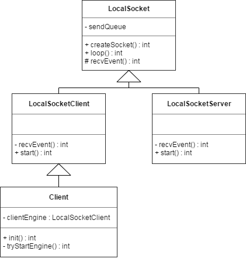
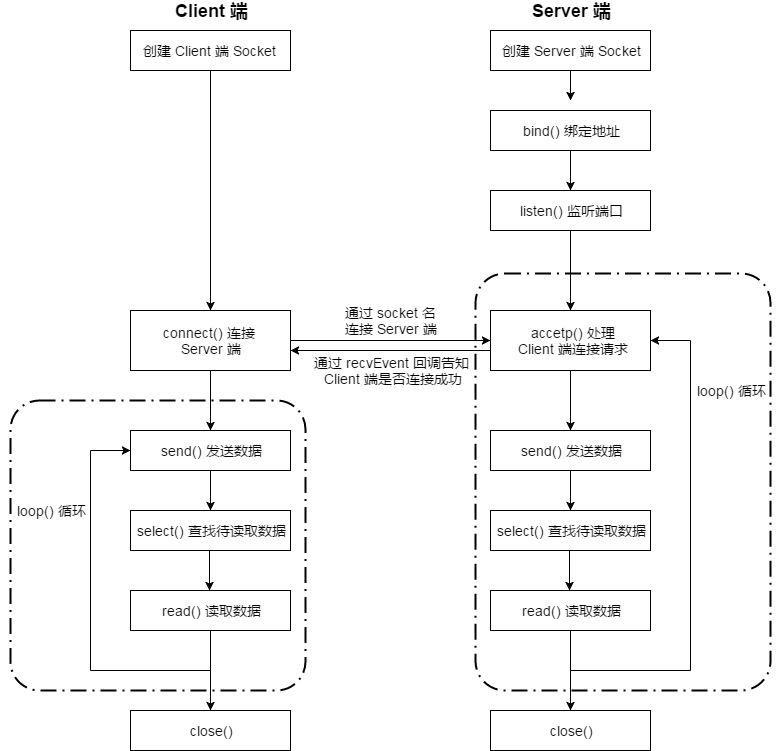

# Hardcoder 性能优化框架技术方案


### Hardcoder 优化目标

Hardcoder 构建 APP 与系统（ROM）之间可靠的通信框架，以达到以下目标：

1 对 APP  - 能够从系统服务侧获取更多的信息和资源，便于问题定位和优化系统调度；
2 对系统  - 能够从 APP 侧获取更多信息以便更合理提供各项资源，方便优化管理 APP 运行；


### Hardcoder 优化基础

Hardcoder 在系统侧主要优化方法有提高 CPU 频率、提高 IO 频率， CPU 锁核以及提高 GPU 频率。


#### 提高 CPU 频率

一般来说，移动设备为了降低功耗，会不同程度地抑制 cpu 频率，同时内核会根据当前的负载动态调整 cpu 频率。这就导致 APP 在执行一些需要资源的操作的时候，不能最大限度利用到 cpu 资源，可能出现卡顿等情况。

而通过修改内核配置，就可以达到提高 cpu 频率的目标。

首先是查看当前系统的 cpu 核数：

```
ls -l  /sys/devices/system/cpu
```

查看 cpu 支持的频率：

```
cat /sys/devices/system/cpu/cpu0/cpufreq/scaling_available_frequencies
```

这里是查看某个核（cpu0）支持的频率。主流的 cpu 都会有大小核的区分，所以并不能保证每个核的支持频率是一样的。一般来说，大核支持更高的频率。

要修改某个核的频率，需要有 root 权限。以下操作就是直接 echo 指定频率到 cpu0 上，以达到提频的效果。

```
echo 1440000  > /sys/devices/system/cpu/cpu0/cpufreq/scaling_max_freq
```

注意包括以下的大部分修改，在手机重启后即失效。

很多时候，为了方便测试，我们会禁用某些核，甚至只给系统留下一个核，以方便做些基准测试。以下命令可禁用某个核。    

```
echo 0 > /sys/devices/system/cpu/cpu0/online 
```

同理，把 0 改成 1，即可启用该核。


#### 提高 IO 频率

就 Hardcoder 项目与部分厂商的沟通过程中，发现厂商并不把 IO 提频看作重点，认为 IO 提频本身效果有限，且必须同时提高 cpu 频率效果才会明显，而部分厂商比如 vivo 则把 IO 频率长期锁定为高频状态。

```
cat /sys/class/mmc_host/mmc0/clk_scaling/enable
```

如果值为1 , 则 emmc 运行在 50MHz 和 200MHz 之间变化；
如果值为0 , 则 emmc 运行在 200MHz 上，也就是高频上了。

通过命令：

```
echo 0 > /sys/class/mmc_host/mmc0/clk_scaling/enable
```

即可将 IO 频率锁定在高频。


#### CPU 锁核

锁核操作实际上操作的是 cpu 亲和度，设置某个线程的 cpu 亲和度，即可变相把线程锁定在某个大核上运行。实际操作中，线程可固定在某个核上运行，但不独占，也就是这个核同样可以执行其他线程的指令。

 

#### 提高 GPU 频率

部分厂商提供了调节 GPU 芯片参数的能力，提高 GPU 频率，从而更好地支持对 GPU 需求较高的场景。


### Hardcoder 通讯方式 —— LocalSocket


Hardcoder 采用 LocalSocket 实现手机本地双方 Native 层实时通信机制。


#### LocalSocket 通信框架

目前在 Android 上进程通信的 IPC 机制主要有 Binder（Java INTENT/AIDL）、共享内存、Socket（TCP/UDP）等，同时在 Java 层 Android 提供了一套 LocalSocket 的API。LocalSocket 的本质是基于对 Linux 层 Socket 的封装，用来进行进程间的通信。LocalSocket 根据是否命名分为两种类型：非命名 LocalSocket 只能在父进程和子进程之间通信（因为其他进程无法获得 Server 端 Socket 名，只有保存了未命名 Socket 的文件描述符的父子进程之间可以使用）；命名的 LocalSocket 则可以在任意进程间进行通信。

Android 中的 LocalSocket 在 Unix 域名空间创建一个 Socket 进行通信。Unix 域名空间 Socket 是在 Socket 基础上衍生的 IPC 通信机制，因此 LocalSocket 是为了解决同一台主机上不同进程间的通信问题，其对应接口和 TCP 等跨网络 Socket 方式一致，但是无需实现复杂的 TCP/IP 协议栈，不需要打包拆包、计算校验，只需通信双方协商好套接字地址（Android 上即为文件描述符）即可。因而 LocketSocket 在 Android 系统中作为 IPC 通信手段被广泛使用。

| **IPC通信机制**   | **安全性**          | **传输效率**                       | **实现及推广难易度**                        |
| ----------------- | ------------------- | :--------------------------------- | ------------------------------------------- |
| Binder            | 支持UID鉴权安全性高 | 单次拷贝                           | 缺少C层公开API，实现难度大                  |
| Ashmem            | 需实现鉴权          | 无需拷贝，效率最高                 | 需额外实现同步，实现难度大                  |
| Socket（TCP/UDP） | 需实现鉴权          | 两次拷贝                           | 技术成熟，系统侧接入难度小                  |
| LocalSocket       | 需实现鉴权          | 两次拷贝，面向本地通信，无需协议栈 | 技术成熟，面向Android设计，系统侧接入难度小 |

由于 Hardcoder 采用 Native 实现，自然无法直接使用 Android SDK 提供的 Java 类的 LocalSocket 和 LocalSocketServer API。当然在 Hardcoder 的设计预期中，使用者无需关心通信细节，所以项目在 C 层使用 Linux 的 Socket 接口实现了一套类 Java 类的 LocalSocket 机制。


Hardcoder 子项目 libapp2sys 中 `localsocket.h` 定义了C++类 Localsocket 用于实现对通信流程的接口封装和逻辑控制。




#### 基类 Localsocket

基类 Localsocket 定义了作为 Socket 双方通信的基本行为接口，主要包括创建接口、循环处理收发数据和回调函数。


##### CreateSocket() 创建接口

```
int createSocket(const char *localPath, const char *remotePath)	
```

CreateSocket() 创建套接字，传入参数为 Server 端的 Socket 名。

对 Server 端，传入的 Socket 名为空，则默认创建 Server 端。先新建套接字 new Socket()，然后 bind() 绑定地址，再调用 listen() 监听端口，一系列系统调用成功后，则进入 loop() 循环等待处理数据。

对 Client 端，传入的 Socket 名有效，则创建 Client 端。先新建套接字 new Socket()，然后 connect() 尝试通过 Socket 名连接 Server 端。连接成功后，Client 端创建子线程进入 loop() 循环等待处理数据。


##### Loop() 循环处理收发数据

```
int loop(const int isServer) 
```

Client 端和 Server 端分别维护一个发送队列 sendQueue，当发送队列不为空则发送数据，否则调用 select() 判断是否有待处理的接收数据，如果有则调用 read() 读取数据然后处理接收数据。

对 Server 端该函数还会调用 accept() 处理 Client 端的连接请求。


##### RecvEvent()回调函数

```
int recvEvent(Event event, int fd, uid_t uid, const char *path, uint8_t *data, int len)
```

RecvEvent() 为虚函数，数据接收处理完后回调上层进行对应的业务处理，具体实现由各自派生类完成。


#### 客户端 LocalsocketClient

客户端 LocalsocketClient 继承自 LocalSocket，是 Client 端实现的 LocalSocket 类，实现在 `client.h` 文件。除了包括基类的基础函数外，主要包括 start() 方法创建连接。

LocalSocketClient 对应实例 Client 由客户端代理类负责创建，主要方法包括初始化和启动。


##### 初始化 init()

```
int init(const char *remote, const int port, const char *local, IC2JavaCallback *callback)
```

上层 JNI 入口调用初始化创建 Client 端，当前版本 Localsocket 实现会忽略 port 和 local 两个参数（UDP 历史实现遗留）， remote 为约定的 Server 端 Socket 名，callback 为 APP 端 Java 层监听 server 端回调函数。


##### 启动函数 tryStartEngine()

```
int tryStartEngine()
```

启动函数 tryStartEngine() 创建本地的 LocalSocketClient 引擎实例 clientEngine，并调用 LocalSocketClient 类 start() 方法创建连接并负责断开超时重连逻辑。


#### 服务端 LocalsocketServer

服务端 LocalsocketServer 继承自 LocalSocket，是 Server 端实现的 LocalSocket 类，实现在 `server.h` 文件，对应实例由服务端代理类负责创建。其创建和 start() 方法由实现了相应服务能力接口的系统级别进程负责调用。


#### Native 层实现的 LocalSocket 流程

对 Server 端，创建 Socket 后，调用 bind() 绑定地址和 listen() 监听端口，进入 loop() 循环。首先通过 accept() 处理来自 Client 端的连接请求，通过 recvEvent() 的回调通知 Client 端是否连接成功；然后检查发送队列 sendQueue 是否有待发送数据，若有则调用 send() 发送数据；再调用 select() 查找是否有待处理的接收数据，有则调用 read() 读取数据进行相应处理；然后重新进行 loop() 循环。

对 Client 端，创建 Socket 后，调用 connect() 通过 Socket 名尝试连接 Server 端，从 recvEvent() 回调获取是否连接成功。若连接成功，则进入 loop() 循环，与 Server 端类似循环 send()、select()、read() 过程。





### Hardcoder 数据格式 —— proto + JSON


Hardcoder 使用 LocalSocket 机制完成 C/S 双向实时通信，client 端到 server 端传输数据简称为**请求（request）**，server 端到 client 端数据简称为**响应（response）**。双向数据包均由包头和包体两部分组成，考虑到为本地通信且已通过 **UID 方式实现鉴权认证**，当前版本所有数据均无加密。


#### 请求数据格式

```
--------------------------------------------------------
| AMCReqHeaderV2 | body(业务请求结构体序列化数据) 		|
--------------------------------------------------------
```

AMCReqHeaderV2 定义在 libapp2sys 子项目的 `header.h` 中。

```
const static uint16_t HEADER_PROTOCAL_VERSION_2 = 16;
const static uint32_t HEADER_BEGIN = 0x48444352;

typedef struct AMCReqHeaderV2 {
	uint32_t begin;     // 包头其起始字段
	uint16_t version;   // 协议版本
	uint16_t funcid;    // 请求对应的function ID
	uint32_t bodylen;   // 包体序列化数据长度
	int64_t	requestid;  // 当前请求包ID
	uint32_t callertid; // 上层JNI调用者所在线程ID
	int64_t timestamp;  // 当前请求时间戳
	uint32_t headerlen; // 包头数据长度（Ver2新增）
	uint32_t bodyformat; //包体数据序列化格式枚举值（Ver2新增）

}__attribute__ ((packed)) AMCReqHeaderV2;
```

其中：

begin 字段固定标识 Hardcoder 通信。

version 字段支持协议版本扩展。

funcid 定义在 `protocol.h`，表明本次客户端请求对应的系统操作，例如申请 CPU 提频或者线程锁核等。

```
const static uint32_t FUNC_BASE = 1000;

const static uint32_t FUNC_CHECK_PERMISSION = FUNC_BASE + 1;

const static uint32_t FUNC_CPU_HIGH_FREQ = FUNC_BASE + 2;
const static uint32_t FUNC_CANCEL_CPU_HIGH_FREQ = FUNC_BASE  + 3;

const static uint32_t FUNC_CPU_CORE_FOR_THREAD = FUNC_BASE + 4;
const static uint32_t FUNC_CANCEL_CPU_CORE_FOR_THREAD = FUNC_BASE + 5;

const static uint32_t FUNC_HIGH_IO_FREQ = FUNC_BASE + 6;
const static uint32_t FUNC_CANCEL_HIGH_IO_FREQ = FUNC_BASE + 7;

const static uint32_t FUNC_SET_SCREEN_RESOLUTION = FUNC_BASE + 8;
const static uint32_t FUNC_RESET_SCREEN_RESOLUTION = FUNC_BASE + 9;

const static uint32_t FUNC_REG_ANR_CALLBACK = FUNC_BASE + 10;

const static uint32_t FUNC_REG_PRELOAD_BOOT_RESOURCE = FUNC_BASE + 11;

const static uint32_t FUNC_TERMINATE_APP = FUNC_BASE + 12;

const static uint32_t FUNC_UNIFY_CPU_IO_THREAD_CORE = FUNC_BASE + 13;
const static uint32_t FUNC_CANCEL_UNIFY_CPU_IO_THREAD_CORE = FUNC_BASE + 14;

static const uint32_t FUNC_REG_SYSTEM_EVENT_CALLBACK = FUNC_BASE + 15;

static const uint32_t FUNC_GPU_HIGH_FREQ = FUNC_BASE + 16;
static const uint32_t FUNC_CANCEL_GPU_HIGH_FREQ = FUNC_BASE + 17;

static const uint32_t FUNC_CONFIGURE = FUNC_BASE + 18;
static const uint32_t FUNC_GET_PARAMETERS = FUNC_BASE + 19;
```

requestid 字段从 0 开始递增保持唯一性。

headerlen 字段为包头长度。

bodyformat 为包体序列化格式，当前取值为：1-raw（byte数组）、2-protobuf 序列化字节流 、3-JSON 序列化字节流。


请求 body 部分如果使用 google protobuf 协议格式实现（C 库），请参见项目`amc.proto` 文件中请求结构体定义，例如申请 CPU 提频的业务请求结构体：

```
message RequestCPUHighFreq{
    required int32 scene = 1;
    required int32 level = 2;
    required int32 timeoutMs = 3;
    required int64 action = 4;
}
```

编译后会自动在 `gen/cpp/amc.pb.h` 文件中生成对应的 C++ 类，主要公开成员函数为序列化/反序列化接口，以及数据属性的 get/set 访问接口。

```
class RequestCPUHighFreq : public ::google::protobuf::MessageLite {

	RequestCPUHighFreq* New() const;
	void CheckTypeAndMergeFrom(const ::google::protobuf::MessageLite& from);
	void CopyFrom(const RequestCPUHighFreq& from);
	void MergeFrom(const RequestCPUHighFreq& from);

	// required int32 scene = 1;
	inline bool has_scene() const;
	inline void clear_scene();
	static const int kSceneFieldNumber = 1;
	inline ::google::protobuf::int32 scene() const;
	inline void set_scene(::google::protobuf::int32 value);
	
	//...

｝
```

调用 `header.h` 的静态函数 genReqPack 即可以完成请求数据包的完整封包逻辑。

```
static int64_t genReqPack(uint32_t funcid, uint8_t *data, int dataLen, uint8_t **outPack, uint32_t *outLen, uint32_t callertid, int64_t timestamp)
```


如果采用 JSON 格式，则使用 key-value 方式，其中 key 统一为字符串，当前版本已有属性定义如下：

"funcid" 和包头中的 funcid 保持一致，int32 格式。

"scene" 场景值，int32 格式，表示 APP 具体业务场景，和 Ver1 已有定义保持一致。

"status" 状态值，int32 格式，表示该操作是一个请求/置位（1）还是取消/复位（2）操作。

"timouts" 超时值，int32 格式，表示该操作任务最长时间，单位 ms。

"cpulevel" 请求 cpu level 值，分为 Level 0~3，具体定义请参见 `protocol.h`。

"iolevel" 请求 io level 值，分为 Level 0~3，具体定义请参见 `protocol.h`。

"gpulevel" 请求 gpu level 值，分为 Level 0和 Level 1，具体定义请参见 `protocol.h`。

"bindtids" 需要绑核的线程，int32格式数组。

"unbindtids" 需要解绑的线程，int32格式数组。


#### 响应数据格式

```
-------------------------------------------------
| AMCRespHeaderV2 |     payload			   |
-------------------------------------------------
```

AMCRespHeaderV2 同样定义在 libapp2sys 子项目的 `header.h` 中：

```
typedef struct AMCRespHeaderV2 {
    uint32_t begin;			// 包头其起始字段
    uint16_t version;		// 协议版本
    uint16_t funcid;		// 响应请求对应的function ID 
		uint32_t retCode;		// 请求处理结果
    uint32_t bodylen;		// 包体序列化数据长度
    int64_t requestid;	// 响应对应的请求包ID
    int64_t timestamp;	// 当前响应时间戳
    uint32_t headerlen; // 包头数据长度（Ver2新增）
		uint32_t bodyformat;//包体数据序列化格式枚举值（Ver2新增）
}__attribute__ ((packed)) AMCRespHeaderV2;
```

begin、version、bodylen、timestamp、headerlen 和 bodyformat 等字段含义与 AMCReqHeader2 中各字段一样用于标识响应包自身属性，而 funcid、requestid 则表示其对应处理的请求包属性，便于请求端确认；如果请求包在解包或者校验方面不通过，则对应的 **retCode** 会返回响应的全局错误码（负值，定义在 `protocal.h`），否则返回 **0 值**或者是**具体业务处理结果**。

```
const static int32_t RET_OK = 0;

//requestCpuHighFreq，requestHighIOFreq 直接返回level n
const static int32_t RET_LEVEL_1 = 1;
const static int32_t RET_LEVEL_2 = 2;
const static int32_t RET_LEVEL_3 = 3;

//预留返回值最后三位作为level，倒数第四位代表cpu level，倒数第五位代表io level，新增值继续左移
const static int32_t RET_CPU_HIGH_FREQ = 1 << 3;// 1000，即8
const static int32_t RET_HIGH_IO_FREQ = 1 << 4; // 10000，即16


//requestUnifyCpuIOThreadCore使用复合标识位
const static int32_t RET_CPU_HIGH_FREQ_LEVEL_1 = RET_CPU_HIGH_FREQ | RET_LEVEL_1;   //Unify接口返回cpu level 1，1000 | 01 = 1001
const static int32_t RET_CPU_HIGH_FREQ_LEVEL_2 = RET_CPU_HIGH_FREQ | RET_LEVEL_2;   //Unify接口返回cpu level 2，1000 | 10 = 1010
const static int32_t RET_CPU_HIGH_FREQ_LEVEL_3 = RET_CPU_HIGH_FREQ | RET_LEVEL_3;   //Unify接口返回cpu level 3，1000 | 11 = 1011

const static int32_t RET_HIGH_IO_FREQ_LEVEL_1 = RET_HIGH_IO_FREQ | RET_LEVEL_1;     //Unify接口返回io level 1，10000 | 01 = 10001
const static int32_t RET_HIGH_IO_FREQ_LEVEL_2 = RET_HIGH_IO_FREQ | RET_LEVEL_2;     //Unify接口返回io level 2，10000 | 10 = 10010
const static int32_t RET_HIGH_IO_FREQ_LEVEL_3 = RET_HIGH_IO_FREQ | RET_LEVEL_3;     //Unify接口返回io level 3，10000 | 11 = 10011


const static int32_t ERR_UNAUTHORIZED = -10001;
const static int32_t ERR_FUNCTION_NOT_SUPPORT = -10002;
const static int32_t ERR_SERVICE_UNAVAILABLE = -10003;
const static int32_t ERR_FAILED_DEPENDENCY = -10004;
const static int32_t ERR_PACKAGE_DECODE_FAILED = -10005;
const static int32_t ERR_PARAMETERS_WRONG = -10006;
const static int32_t ERR_CLIENT_UPGRADE_REQUIRED = -10007;

const static int32_t ERR_CLIENT_DISCONNECT = -20001;
const static int32_t ERR_CLIENT_RESPONSE = -20002;
```

请求 body 部分如果使用 protobuf 定义，请参见项目`amc.proto` 文件中响应结构体定义；如果采用 JSON 格式，属性定义与 AMCReqHeaderV2 保持一致。

调用 `header.h` 的静态函数 genRespPack 即可以完成响应数据包的完整封包逻辑。

```
static int64_t genRespPack(uint32_t funcid, uint32_t retCode, uint64_t requestid, uint8_t *data, int dataLen, uint8_t **outPack, uint32_t *outLen) 	
```


### Native 层实现的 LocalSocket 鉴权方式

 

由于 Native 层实现的 LocalSocket 通信方案为本地进程间通信，因而只需要在 Server 端接收到 Client 端请求时，通过调用 getsockopt() 方法获取到 Client 端的 UID，然后通过 UID 反查出 Client 端对应的 APP 信息，进而完成响应的鉴权处理。