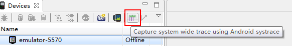
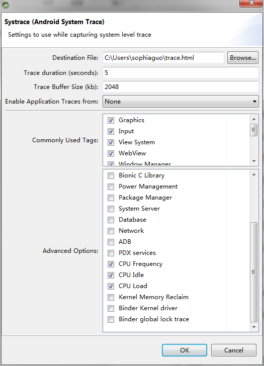
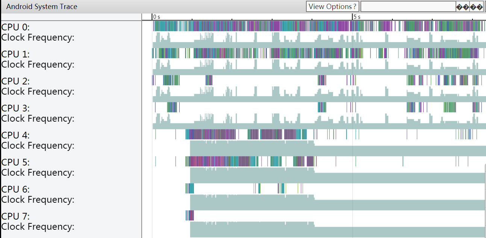
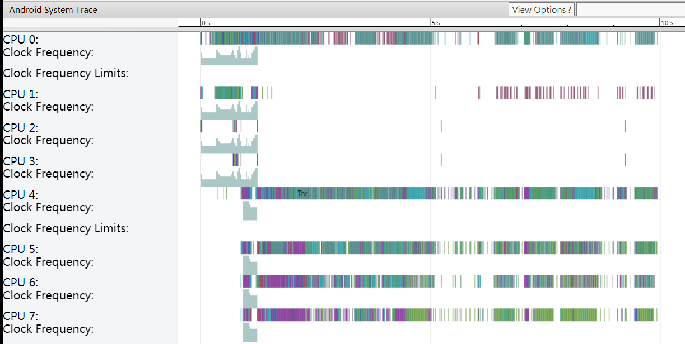
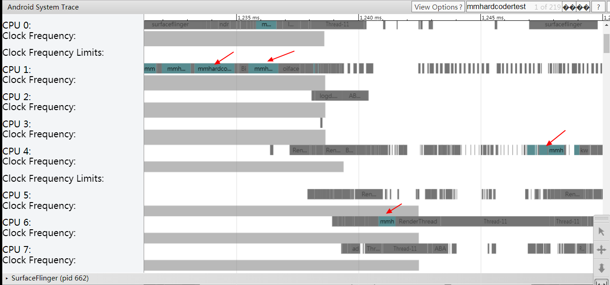
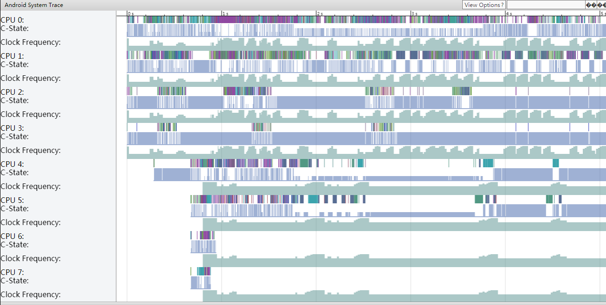
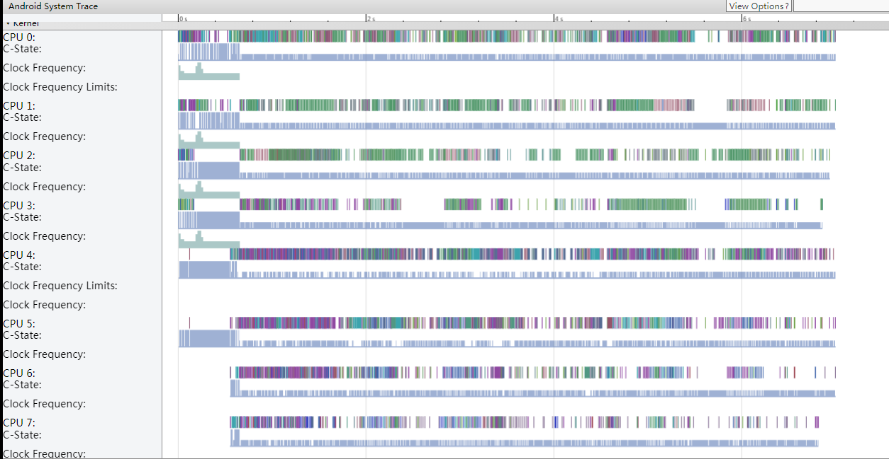
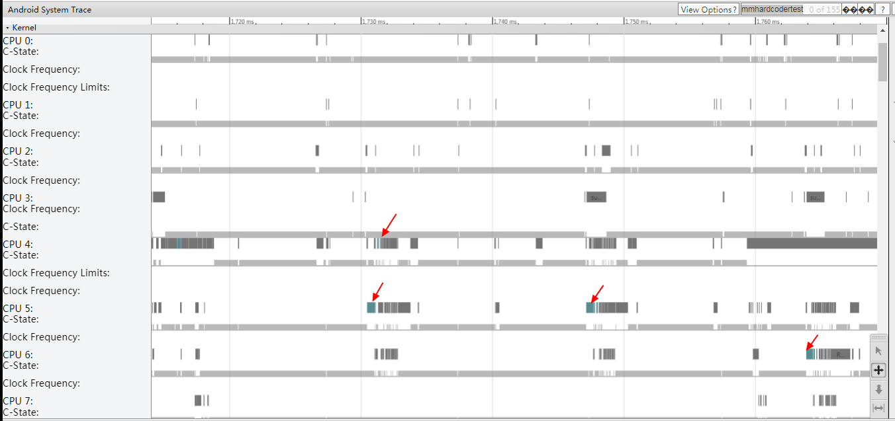

# Hardcoder Testapp 测试指南


Hardcoder 项目工程包括两部分，其中 libapp2sys 为客户端、通信以及服务端接口代码，其技术框架介绍请见 [Hardcoder 性能优化框架技术方案](./hardcoder_technology_introduction.md)；另外一部分 testapp 为测试 apk 代码，可快速运行 Hardcoder 并测试 Hardcoder 效果。

Testapp 提供了 Hardcoder 中主要接口的调用，通过 testapp 验证 Hardcoder 效果，决定是否接入 Hardcoder。


### 测试准备

准备一台已支持 Hardcoder 的测试手机。目前 Hardcoder 已覆盖主流厂商多个机型。可使用 testapp 验证测试机是否支持 Hardcoder，具体方法请见下文测试入口介绍的 initHardCoder 部分。

推荐使用 OPPO（R15 以上机型）进行测试，其 socket name 为 oiface，在系统日志查找 oiface 关键字即可查看系统 Hardcoder 日志。


### 编译 testapp

项目 IDE 为 AndroidStudio，采用 gradle 构建，其中 Native 部分代码使用 CMAKE 编译。

1. 根目录下运行命令行 `gradlew assembleDebug` 触发子工程  libapp2sys 编译，编译成功后生成 Hardcoder aar， 输出目录为`hardcoder/libapp2sys/build/outputs/aar/libapp2sys-debug.aar`；
2. testapp 无需指定 Hardcoder 版本号，直接使用输出目录aar进行编译，根目录下运行命令行`gradlew :testapp:assembleDebug` 生成测试包testapp的apk，输出目录为`hardcoder/testapp/outputs/apk/debug/testapp-debug.apk`
3. 在测试机上安装 testapp-debug.apk 并运行。


##### 编译可能遇到的问题

1. Hardcoder 工程目录下提示没有 gradlew 权限。

   解决方法：Hardcoder 根目录下运行：

   ```
   chmod +x gradlew
   ```

   

2. ```
   SDK location not found. Define location with sdk.dir in the local.properties file or with an ANDROID_HOME environment variable.
   ```

   原因：项目没有配置 SDK / NDK 路径。

   解决方法：Hardcoder 工程根目录下 `local.properties` （若没有则新增一个），配置本机 sdk 路径和 ndk 路径。

   ```
   sdk.dir=
   ndk.dir=
   ```

   

3. ```
   * What went wrong:
   Execution failed for task ':libapp2sys:generateProto'.
   > java.io.IOException: Cannot run program "/Hardcoder/libapp2sys/prebuilt/protoc/darwin/protoc" (in directory "/Hardcoder/libapp2sys/src/main/proto"): error=13, Permission denied
   ```

   原因：`/Hardcoder/libapp2sys/prebuilt/protoc/darwin` 目录没有执行 protoc 的权限。

   解决方法：到该目录下打开 protoc 的权限。

   ```
   cd /Hardcoder/libapp2sys/prebuilt/protoc/darwin
   chmod +x protoc
   ```

   

### 主要测试方法介绍

##### Hardcoder开关

Hardcoder state 按钮，点击可打开/关闭 Hardcoder，用于对请求进行对比测试。


##### InitHardCoder

主要验证 Hardcoder 与系统间通信连接是否正常，每次启动应用后都需要点击 initHardCoder 建立 socket 连接再进行请求，否则 Hardcoder 不生效。

**验证测试机是否支持 Hardcoder 方法：点击 initHardCoder 按钮，弹出 Toast 中若 server socket name 显示不为空，则此测试机支持 Hardcoder，若为空，则此测试机未支持 Hardcoder。**

Server socket name 为系统 Hardcoder server 端名称，例如 OPPO 手机 server socket name 为 oiface，即可通过系统日志中过滤关键字 oiface 提取 Hardcoder 日志。在命令行输入：

```
adb logcat -d | grep oiface
```

点击 testapp 中的 initHardCoder 按钮，出现日志即 Hardcoder 与系统通讯连接正常。

```
09-23 21:59:43.434 16074 16116 I Hardcoder.HardCoderJNI: readServerAddr, serverprop[persist.sys.hardcoder.name] result[oiface]
09-23 21:59:43.439 16074 16116 D HARDCODER: [client.h,init:477]"init m_remote:oiface, HEADER_VERSION:4"
09-23 21:59:43.439 16074 16116 D HARDCODER: [client.h,tryStartEngine:371]"tryStartEngine, TimeDiff:1584120399, remote:oiface, running:-1"
09-23 21:59:43.439 16074 16116 D HARDCODER: [localsocket.h,createSocket:249]"createSocket, localPath: .hardcoder.client.sock, remotePath: oiface"
09-23 21:59:43.440  3069  3072 D oiface  : socket @oiface(16 2) received event
09-23 21:59:43.440  3069  3072 I oiface  : pid:16074 uid:10145 gid:10145
09-23 21:59:43.440  3069  3072 I oiface  : pid:16074 uid:10145 gid:10145
09-23 21:59:43.440 16074 16116 W HARDCODER: [localsocket.h,createSocket:310]"createSocket, connect socket, ret:0, local:.hardcoder.client.sock, remote:oiface"
09-23 21:59:43.440 16074 16116 W HARDCODER: [localsocket.h,createSocket:353]"create ClientProtocal socket:59 local:.hardcoder.client.sock remote:oiface"
09-23 21:59:43.440  3069  3072 D oiface  : SocketParser uid_10145_pid_16074_fd_20(20 3) constructor
09-23 21:59:43.440  3069  3072 I oiface  : pid:16074 uid:10145 gid:10145
09-23 21:59:43.440 16074 16116 I hardcoder.MainActivity: initHardCoder, server socket name:oiface
```


##### CheckPermission

CheckPermission 用于把鉴权值发送到系统侧验证 APP 是否具有使用 Hardcoder 的权限。不同厂商对 checkPermission 的实现不一样，具体请参见[常见问题](./FAQ.md)中 1。

对需要鉴权的厂商，必须调用 checkPermission 接口把鉴权值传入才可使用 Hardcoder；对没有实现 checkPermission 接口的厂商，系统不会有对应 callback，因而后续请求调用不应依赖于 checkPermission 的回调。


##### RequestCpuHighFreq 和 CancelCpuHighFreq

向系统申请提高 cpu 频率。以八核 OPPO R11 为例，cpu0~cpu3 为小核，cpu4~cpu7 为大核。在命令行输入：

```
cat /sys/devices/system/cpu/cpu0/cpufreq/cpuinfo_max_freq;
cat /sys/devices/system/cpu/cpu0/cpufreq/scaling_cur_freq;
```

可以分别查看到核的最大频率和当前频率。

```
R11:/ # cat /sys/devices/system/cpu/cpu0/cpufreq/scaling_cur_freq;
1843200
R11:/ # cat /sys/devices/system/cpu/cpu4/cpufreq/scaling_cur_freq;
2208000
R11:/ # cat /sys/devices/system/cpu/cpu0/cpufreq/scaling_cur_freq;
633600
R11:/ # cat /sys/devices/system/cpu/cpu4/cpufreq/scaling_cur_freq;
1113600
```

从中可以看到正常情况下系统的大小核的频率是远远达不到最高频率的，甚至于只打开了小核，没有打开大核。

点击 requestCpuHighFreq 按钮向系统申请提频后，可以看到 cpu 频率都提到了最大频率。点击 cancelCpuHighFreq 按钮或者等待一定的超时时间后系统 cpu 频率恢复到正常。

```
R11:/ # cat /sys/devices/system/cpu/cpu0/cpufreq/cpuinfo_max_freq;
1843200
R11:/ # cat /sys/devices/system/cpu/cpu4/cpufreq/cpuinfo_max_freq;
2208000
R11:/ # cat /sys/devices/system/cpu/cpu0/cpufreq/scaling_cur_freq;
1401600
R11:/ # cat /sys/devices/system/cpu/cpu4/cpufreq/scaling_cur_freq;
1113600
```


##### RequestCpuCoreForThread 和 CancelCpuCoreForThread

把线程绑定到大核上运行，具体效果见下文 trace 文件验证。


##### RequestUnify 和 CancelUnify

混合接口，同时向系统申请提高 cpu 频率和把任务绑定到大核上。


##### StartPerformance 和 StopPerformance

对应 HardCoderJNI 中封装的 JAVA 层调用的请求接口，其他请求为 native 层接口，建议 APP 调用此封装接口，可同时执行多种请求操作。


##### 多进程连接

MultiProcess 按钮会跳转到另外一个 activity，点击 activity 的 initHardCoder 会在子进程建立 Hardcoder 连接。正常情况下一个进程维持一个 socket 连接。


##### 目前没有写测试方法的接口

```
requestHighIOFreq
cancelHighIOFreq
requestGpuHighFreq
cancelGpuHighFreq 
```

开发者可自行编写测试代码测试。


### Trace 文件验证

Android Studio -> Tools -> Android -> Android Device Monitor 打开DDMS。

连接手机后，点击 Devices 下的 Capture system wide trace using Android systrace。

 

配置里勾上 Cpu 相关信息，配置好生成文件路径，点击 ok。



接下来的一段时间，DDMS 会记录手机的运行状态，并生成 trace 文件，生成的 trace 文件使用 **chrome浏览器** 打开就可以观察 cpu 的运行状态。


##### RequestCpuHighFreq 对比

Testapp 中运行一个 pitest 较复杂运算任务，对比是否执行 requestCpuHighFreq 的 cpu 状态。图中为 OPPO R11 八核手机，CPU0~CPU3 为小核，CPU4~CPU7 为大核。

关闭 Hardcoder 状态下，任务开始执行前只打开了小核，并没有打开大核；任务开始执行后，打开了一部分大核，但是并没有全部打开。




打开 Hardcoder 状态下，任务开始执行前只打开了小核，并没有打开大核；执行 requestCpuHighFreq 后，大核全部打开并提到了最高频率。




##### RequestUnify 对比

Testapp 中运行一个 pitest 较复杂运算任务，对比是否执行 requestUnify 的 cpu 状态。

在执行了 requestCpuHighFreq 的 trace 文件中可以看到虽然 cpu 频率提高了，但是任务还是会在不同的大小核间切换，取决于系统的 cpu 调度，实际上切核操作会影响任务的执行效率。下图蓝绿色为测试线程的任务执行的时间片段。




RequestUnify 同时请求了 **cpu 提频**和**绑核**两个操作。

关闭 Hardcoder 状态下，任务开始执行前只打开了小核，并没有打开大核；任务开始执行后，打开了一部分大核，但是并没有全部打开。




打开 Hardcoder 状态下，任务开始执行前只打开了小核，并没有打开大核；执行 requestUnify 后，大核全部打开并提到了最高频率，而且 mmhardcodertest 的任务固定在大核上执行。




如下图，任务 mmhardcodertest 只在大核间切换，没有在大小核间切换。




